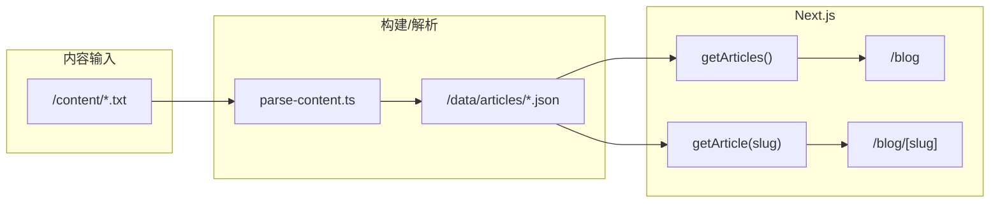

# YouTube 摘要博客 Web App 实施计划

## 1. 项目初始化

- 使用 `create-next-app` 创建项目（App Router、TypeScript、TailwindCSS、ESLint），或手动初始化 `package.json`、`tsconfig.json`、`next.config.js`、`tailwind.config.ts`。
- 在 `package.json` 中增加脚本：
  - `"parse": "tsx scripts/parse-content.ts"`（需安装 `tsx` 以便直接运行 TS 脚本）。
- 创建规范中的目录：`/content`、`/data/articles`、`/scripts`、`/app/blog/[slug]`、`/components`、`/lib`、`/public`、`/styles`。

## 2. 数据与类型定义

- **文章 JSON 结构**（便于后续加 ja/ko/fr/es）：
  - `slug`、`title: { zh, en }`、`description: { zh, en }`、`sections: [{ title: { zh, en }, content: { zh, en } }]`。
  - 预留字段（可为空）：`tags?: string[]`、`category?: string`、`videoId?: string`，便于未来扩展搜索、分类、YouTube 关联。
- 在 `lib/` 下定义共享 TypeScript 类型（如 `Article`, `Section`, `Locale`），供 parser、getArticle、getArticles 和页面组件使用。

## 3. 解析脚本 `/scripts/parse-content.ts`

- 使用 Node.js `fs.readdirSync` / `fs.readFileSync` 读取 `/content` 下所有 `.txt` 文件（路径可基于 `process.cwd()` 或 `path.join(__dirname, '..')`）。
- **Slug**：由文件名生成，例如 `article1.txt` → `article1`，去掉扩展名并做简单规范化（小写、替换空格为 `-`、去掉非法字符）。
- **解析规则**：
  - 以 `TITLE:`、`TITLE_EN:`、`DESCRIPTION:`、`DESCRIPTION_EN:` 开头的行解析为对应字段（支持多行 DESCRIPTION 直到下一个关键字）。
  - 以 `#` 开头的行视为 section 标题；该行之后、下一个 `#` 之前的所有行为该 section 的 content。
- **双语 section**：首版 TXT 若仅有一种语言，可把解析出的标题和正文同时写入 `zh` 和 `en`，或仅填 `zh`、`en` 留空由前端回退显示。后续若增加 `# 1. 中文标题 | English Title` 或分段 `---EN---` 等约定，只需在 parser 中扩展逻辑，不改变 JSON 的 `title/content: { zh, en }` 结构。
- 将每篇文章写成单独 JSON 文件到 `/data/articles/<slug>.json`，便于静态读取与增量更新。

## 4. 数据读取层 `/lib`

- **getArticles.ts**：读取 `/data/articles` 下所有 `.json`，反序列化并返回 `Article[]`（可按 `slug` 或日期排序，若未来有 `date` 字段可在此排序）。
- **getArticle(slug).ts**：根据 `slug` 读取 `/data/articles/<slug>.json`，不存在则返回 `null`。
- 路径使用 `path.join(process.cwd(), 'data', 'articles')` 与 Next.js 静态生成兼容；若需在 build 时跑 parser，可在 `package.json` 的 `build` 前加 `npm run parse`（可选）。

## 5. 博客路由与页面

- `**/app/blog/page.tsx`**（博客首页）  
  - 使用 `getArticles()` 获取列表。  
  - 展示每篇文章的标题（默认 zh，或按 `?lang=` 选 en）、短描述（description 截断）、链接到 `/blog/[slug]`。  
  - 服务端组件即可；若需客户端语言切换可配合 `LanguageSwitch`。
- `**/app/blog/[slug]/page.tsx`**（文章详情）  
  - 从 `params.slug` 取 slug，`searchParams.lang` 取 `lang`（`zh` | `en`，默认 `zh`）。  
  - 调用 `getArticle(slug)`；无数据则 `notFound()`。  
  - 使用 `generateMetadata({ params, searchParams })` 设置：
    - `title`：当前语言的 title + 站点名。
    - `description`：当前语言的 description。
    - `openGraph.title` / `description` / `url`（例如 `https://yoursite.com/blog/${slug}?lang=${lang}`）。
  - 将文章与当前 `lang` 传给布局与区块组件渲染。

## 6. 组件实现

- **ArticleLayout**  
  - 外层容器：`max-w-[720px]`、`mx-auto`、合理水平 padding（如 `px-4`/`px-6`）。  
  - 排版：字体、行高、段落间距（Tailwind：`prose` 或自定义 `text-lg leading-[1.7]`）。  
  - 接收 `children`、可选 `title`/`description`（若在 layout 层统一展示）。
- **SectionBlock**  
  - Props：`title: string`、`content: string`（由父组件按当前 lang 取好 zh/en）。  
  - 渲染 section 标题（如 `text-xl font-semibold`）+ 段落（`whitespace-pre-wrap` 若保留换行）。
- **LanguageSwitch**  
  - 客户端组件：显示 zh / en 切换（按钮或链接）。  
  - 切换时跳转到当前 path + `?lang=zh` 或 `?lang=en`（保留当前 slug），使整站语言一致；可选存 `localStorage` 用于下次访问默认语言。

## 7. 样式与移动端

- 全局：在 `/styles/globals.css` 中引入 Tailwind；可设 `font-size: 18px`、`line-height: 1.7` 在 body 或文章容器上，确保阅读体验接近 Medium/Substack/Notion。
- 区块间距：section 之间 `space-y-6` 或等效 margin。
- 使用 Tailwind 响应式类（如 `px-4 sm:px-6`），保证 720px 居中在手机上不贴边。

## 8. 示例内容与校验

- **示例 TXT**：在 `/content` 放 `article1.txt`（或 `mitchell-hashimoto-story.txt`），严格按你给的 TITLE/DESCRIPTION/# section 格式，便于测试 parser。
- **示例 JSON**：运行 `npm run parse` 后，在 `/data/articles` 得到对应 `.json`，可作为文档中的“示例输出”并用于开发时预览。

## 9. 静态生成与 Vercel

- 博客首页：在 `/app/blog/page.tsx` 中 `export const dynamic = 'force-static'`（或默认静态），并在 build 时通过 `getArticles()` 拉取数据。
- 文章页：`generateStaticParams` 中根据 `getArticles()` 返回的 slug 列表生成 `[{ slug }]`，使 `/blog/[slug]` 在 build 时预渲染，SEO 与性能最优。
- 确保 `data/articles` 的 JSON 不包含在 client bundle 中（仅服务端/构建时读取），符合静态站点部署。

## 10. 端到端流程与未来扩展

- **流程**：用户将 TXT 放入 `/content` → 执行 `npm run parse` → 生成/更新 `/data/articles/*.json` → `npm run build` 时 Next.js 读取 JSON 并生成静态页；本地 `npm run dev` 同样读取这些 JSON。
- **扩展预留**：
  - 文章类型中已预留 `tags`、`category`、`videoId`；后续可在 parser 中从 TXT 元数据或文件名解析这些字段。
  - 多语言：JSON 保持 `title/description/sections[].title|content` 为 `Record<Locale, string>`，新增语言只需加 key（如 `ja`）并在 LanguageSwitch 与 URL 中支持。
  - 搜索/标签/分类：可在博客首页或单独页面通过 `getArticles()` 结果在前端过滤，或后续增加 API/服务端过滤。

---

## 关键文件一览

| 用途       | 路径                                                                                                                                                                                     |
| -------- | -------------------------------------------------------------------------------------------------------------------------------------------------------------------------------------- |
| 解析脚本     | [scripts/parse-content.ts](scripts/parse-content.ts)                                                                                                                                   |
| 文章类型     | [lib/types.ts](lib/types.ts)（或合并到 getArticle 中）                                                                                                                                        |
| 数据读取     | [lib/getArticles.ts](lib/getArticles.ts)、[lib/getArticle.ts](lib/getArticle.ts)                                                                                                        |
| 博客列表     | [app/blog/page.tsx](app/blog/page.tsx)                                                                                                                                                 |
| 文章详情     | [app/blog/[slug]/page.tsx](app/blog/[slug]/page.tsx)                                                                                                                                   |
| 布局/区块/语言 | [components/ArticleLayout.tsx](components/ArticleLayout.tsx)、[components/SectionBlock.tsx](components/SectionBlock.tsx)、[components/LanguageSwitch.tsx](components/LanguageSwitch.tsx) |
| 示例内容     | [content/article1.txt](content/article1.txt) → [data/articles/article1.json](data/articles/article1.json)                                                                              |

## 架构示意

执行顺序建议：初始化 Next.js 与目录 → 类型与 parser → 数据层 getArticles/getArticle → 组件 → 博客列表与详情页 → SEO 与样式 → 示例 TXT 与一次完整 parse 验证。